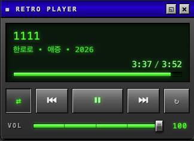

# Retro YT Music Player

YouTube Music (`music.youtube.com`)에 **레트로 스테레오 스킨**을 오버레이하는 Chrome 확장입니다.
우측 상단에 80–90년대 오디오 기기 느낌의 녹색 LCD 디스플레이 + 금속 베젤 버튼 패널이 떠서
재생/일시정지/이전/다음 곡 조작과 탐색을 대신할 수 있습니다.



## 설치 (개발 모드)

1. Chrome에서 `chrome://extensions` 열기
2. 우측 상단 **개발자 모드** 토글 ON
3. **압축해제된 확장 프로그램을 로드합니다** 클릭 → 이 폴더 선택
4. **[필수] 사이트 액세스 설정** — 아래 [일회성 설정](#일회성-설정-중요) 참고
5. YouTube Music 탭(또는 Chrome 앱 창)을 새로고침

Chrome 앱으로 설치한 YTM에서도 동일하게 동작합니다 (같은 `music.youtube.com` origin).

## 일회성 설정 (중요)

Chrome 127+ 의 확장 보안 정책상, 확장 아이콘을 처음 클릭하면
**"이 페이지를 새로고침하여 이 사이트에 업데이트된 설정 적용"** 팝업이 뜨고 재생이 끊깁니다.
이 팝업은 Chrome 자체가 띄우는 것이라 **확장 코드로 억제할 수 없습니다.**

다음 단계를 **한 번만** 해두면 이후로는 절대 안 뜹니다:

1. `chrome://extensions` 열기
2. **Retro YT Music Player** 카드의 **세부정보** 클릭
3. **사이트 액세스** 섹션에서 다음 중 하나 선택
   - **특정 사이트에서** → `https://music.youtube.com/*` 추가 ← 권장
   - 또는 **모든 사이트에서**
4. YTM 탭을 한 번만 새로고침

이 설정 이후에는:
- 페이지 로드 시 content script가 자동 주입됨
- 툴바 아이콘 클릭은 순수 On/Off 토글 메시지만 전송 → Chrome 팝업 없음, 음악 끊김 없음
- 상태가 `chrome.storage`에 저장되어 새로고침/재시작해도 유지

## 조작

- **툴바 아이콘 클릭** — 레트로 플레이어 **On/Off 토글** (페이지 새로고침 없이, 음악 끊김 없이). 상태는 `chrome.storage`에 저장되어 새로고침/재시작해도 유지됨
- **타이틀바 드래그** — 패널 위치 이동
- **진행 바 클릭** — 해당 지점으로 탐색
- **▶ / ⏸ / ⏭ / ⏮** — 재생 제어 (내부적으로 YTM 원본 버튼을 클릭)
- **⇄ (셔플)** — 활성 시 녹색 점등
- **↻ (반복)** — 3단계 토글: off → 전체(↻ 녹색) → 한 곡(↻1 녹색) → off
- **VOL 슬라이더** — 믹서 페이더 스타일. 크롬 그립 핸들을 **좌우 드래그** 또는 트랙 임의 지점 클릭으로 볼륨 조절. 마우스 휠도 지원. 녹색 LED 레벨 바로 현재 볼륨 시각화, 오른쪽에 숫자 %. 0까지 내리면 자동 뮤트
- **앨범 자켓** — LCD 디스플레이 좌측에 43×43 자켓 표시. 원본 색감에 가벼운 그린 wash. YTM이 곡을 바꿀 때만 갱신 (MutationObserver). 자켓이 없거나 로드 실패하면 자동 숨김
- **▼ QUEUE / ▶ QUEUE (재생 목록)** — 볼륨 슬라이더 아래 토글 버튼. 펼치면 현재 재생 큐 표시 — 현재 곡은 ▶ 마커 + 네온 그린, 다른 곡 클릭 시 해당 곡으로 점프. 펼침 상태는 `chrome.storage`에 저장. 펼칠 때 현재곡이 자동으로 리스트 최상단으로 스크롤
- **▭ (컴팩트 / PiP)** — Document Picture-in-Picture 창으로 분리. OS 레벨 **항상 최상단** 미니 창으로 떠서 다른 앱 위에서도 계속 보임. 원본 YTM 창은 그대로 유지. 한 번 더 누르거나 PiP 창을 닫으면 원위치 복귀. Chrome 116+ 필요
- **⊡ (PiP 전용, 좌상단)** — PiP 창을 현재 컨텐츠 크기에 맞춤. **언제 쓰는가**: Chrome Document PiP는 사이트별 마지막 사용 창 크기를 기억해서 `requestWindow()` 힌트보다 우선시함. 그래서 PiP에서 큐 접고 → 메인으로 이동 → 메인에서 큐 펼치고 → 다시 PiP 진입하면 PiP가 작은 (이전 접힌) 크기로 열려 큐가 잘림. 이 때 ⊡ 버튼을 한 번 누르면 user activation으로 `resizeTo()`가 통해서 정확히 컨텐츠에 맞춰짐. PiP 안에서만 좌상단에 `position: fixed`로 항상 떠있음
- **×** — Off와 동일 (아이콘 다시 클릭하면 복귀)

## 개발 팁

확장 코드를 수정한 뒤에는 `chrome://extensions`에서 **새로고침 아이콘**만 눌러주면 끝입니다 — 이미 열려있는 YTM 탭에도 background가 `chrome.scripting`으로 content script를 **자동 재주입**하므로 YTM 탭을 새로고침할 필요가 없습니다. 혹시 복구가 필요하면 툴바의 확장 아이콘을 한 번 클릭하면 현재 탭에 다시 주입됩니다.

## 구조

```
manifest.json   # MV3, music.youtube.com 에만 주입, scripting 권한
background.js   # 확장 리로드/설치 시 열린 YTM 탭에 자동 주입 + 아이콘 클릭 시 on/off 토글 메시지 전송
content.js      # 오버레이 생성 + YTM DOM/비디오 브리지 + Document PiP 토글 + 큐 패널 (MutationObserver로 ytmusic-player-queue 변경 감지) + 앨범 자켓 (img.image src 변경 감지) + PiP 자동 리사이즈 + 이전 인스턴스 teardown
main-world.js   # main world 브리지: mediaSession / ytmusic-player-bar 속성(shuffle-on, repeat-mode) / playerApi_ (볼륨·재생시간·연도) / .time-info 텍스트를 읽어 <html> data 속성에 JSON export + content.js의 postMessage(setVolume) 수신해 playerApi_.setVolume 호출
overlay.css     # 레트로 스테레오 스킨 + 컴팩트 모드 + 큐 패널 + 앨범 자켓 그린 wash
```

## 한계 & 다음 단계

- **[해결 불가] Chrome 사이트 액세스 첫 그랜트 팝업** — 사용자가 "특정 사이트" 또는 "모든 사이트" 액세스를 허용하기 전까지 Chrome이 새로고침 요구 팝업을 띄움. 확장 API로 우회 불가능한 Chrome 시스템 UX. 자세한 건 [일회성 설정](#일회성-설정-중요) 참고.
- **[부분 해결] PiP remembered-size quirk** — Chrome Document PiP가 origin별 마지막 사용 창 크기를 기억해 `requestWindow()` 힌트보다 우선시함. 또한 진입 직후 `resizeTo()`는 user activation 부족으로 거부됨. 좌상단 `⊡` 버튼으로 사용자가 명시적으로 fit 가능 (자세한 건 [조작](#조작) 참고).
- YTM DOM 클래스명이 바뀌면 셀렉터가 깨질 수 있음 — `content.js`의 `getBtn` / `getTitleText` / `getArtistText` / `readQueueItems` / 자켓 셀렉터에 후보를 추가하면 방어됨.
- 현재는 **오버레이 모드**. 원본 UI 숨김 + 전체 대체 모드는 컴팩트 모드로만 제공.
- 로드맵:
  - [ ] 옵션 페이지 (스킨 선택, 위치 저장)
  - [x] 앨범 아트 표시 (LCD 그린 wash)
  - [x] 재생 큐 패널
  - [ ] Winamp 2.x / iPod / Walkman 스킨 프리셋
